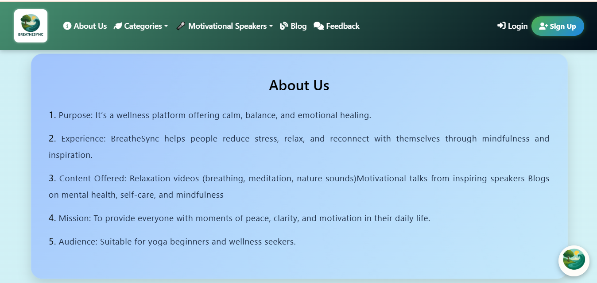
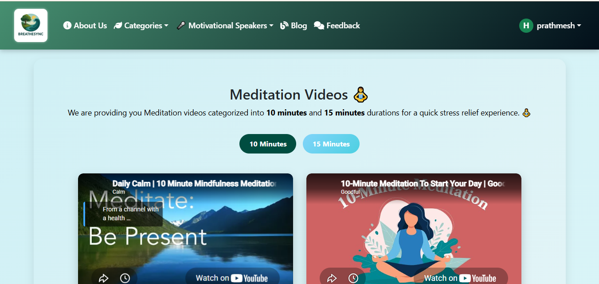
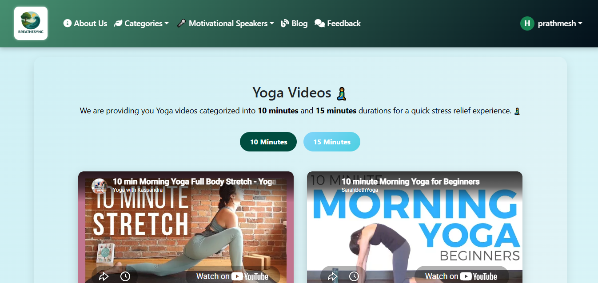
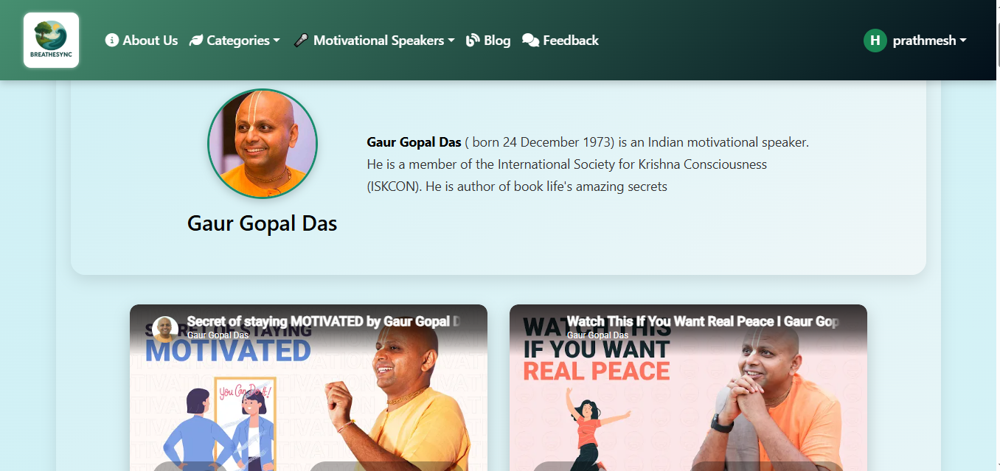
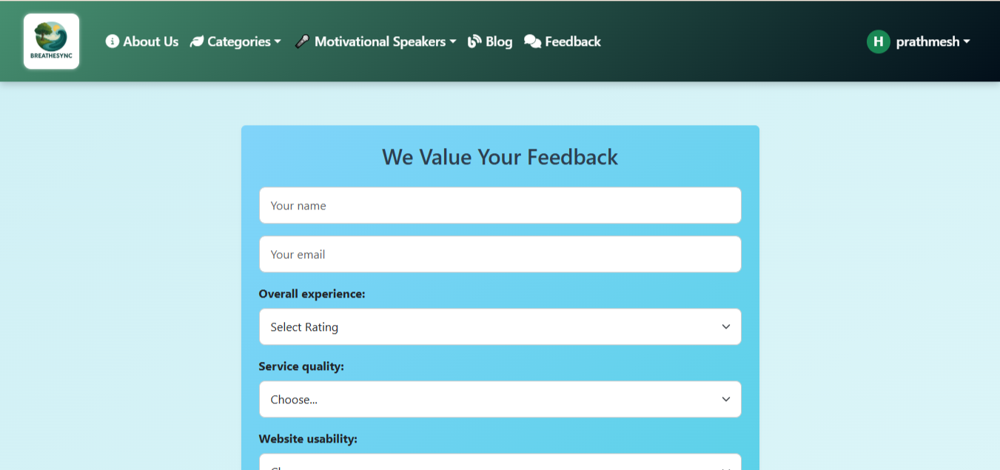

# BreatheSync 🌿

BreatheSync is a web-based stress-relief and wellness platform developed as my **BCA Final-Year Project**.

The main purpose of BreatheSync is to provide users with a digital space where they can explore meditation, yoga, motivational content, wellness blogs, and other self-care resources through a simple and user-friendly web application.

---

## 📌 Project Overview

BreatheSync is designed as a wellness platform focused on helping users explore content related to relaxation, mindfulness, motivation, yoga, and self-care.

The platform brings different types of wellness resources together in one place. Users can explore meditation and yoga videos, discover motivational speakers, read wellness blogs, and provide feedback about their experience.

The project also includes user authentication functionality through registration and login pages.

---

## 🎯 Project Objectives

The main objectives of BreatheSync are:

- To create a centralized platform for wellness-related content.
- To provide easy access to meditation and yoga resources.
- To provide motivational content from inspiring speakers.
- To provide wellness and mindfulness-related blogs.
- To encourage relaxation and self-care.
- To create a simple and user-friendly website interface.
- To allow users to register and log in to the platform.
- To provide a feedback system for collecting user opinions.
- To develop a practical web application as part of the BCA final-year project.

---

## ✨ Key Features

### 🧘 Meditation

Users can explore meditation videos categorized into different durations, including:

- 10-minute meditation sessions
- 15-minute meditation sessions

This makes it easier for users to choose content according to the time available to them.

### 🧘‍♀️ Yoga

The Yoga section provides yoga videos categorized according to duration.

Users can explore:

- 10-minute yoga sessions
- 15-minute yoga sessions

### 🎤 Motivational Speakers

The platform contains motivational content from inspiring speakers.

Users can explore speaker information and motivational videos designed to provide inspiration and positive motivation.

### 📝 Wellness Blogs

BreatheSync includes a dedicated blog section containing wellness and mindfulness-related articles.

The blog content covers topics such as:

- Stress relief
- Mindfulness
- Self-care
- Relaxation
- Daily wellness practices

### 💬 Feedback System

Users can provide feedback about their experience with the platform.

The feedback section includes fields for:

- Name
- Email
- Overall experience
- Service quality
- Website usability
- Additional feedback

### 🔐 User Registration

New users can create an account by providing:

- Full name
- Email address
- Password
- Terms and conditions agreement

### 🔑 User Login

Registered users can log in to the BreatheSync platform using their email address and password.

### 👤 User Profile

The application provides a user profile area for logged-in users.

---

## 🛠️ Technologies Used

The project was developed using the following technologies:

- **Python**
- **Flask**
- **HTML5**
- **CSS3**
- **JavaScript**
- **SQLite**
- **Jinja2**

---

## 📂 Project Structure

```text
BreatheSync/
│
├── Static/
│
├── Templates/
│
├── app.py
│
├── BreatheSync Presentation.pptx
│
└── README.md


# 📸 Project Screenshots

## 🏠 About Us



The About Us page provides an overview of BreatheSync, including its purpose, experience, content, mission, and target audience.

---

## 🧘 Meditation



The Meditation section provides users with meditation videos categorized into 10-minute and 15-minute sessions.

---

## 🧘‍♀️ Yoga



The Yoga section provides yoga videos categorized into 10-minute and 15-minute sessions for users looking for short wellness activities.

---

## 🎤 Motivational Speakers



The Motivational Speakers section provides motivational content from inspiring speakers.

---

## 💬 Feedback



The Feedback section allows users to provide their name, email, ratings, and feedback about their experience with the platform.
